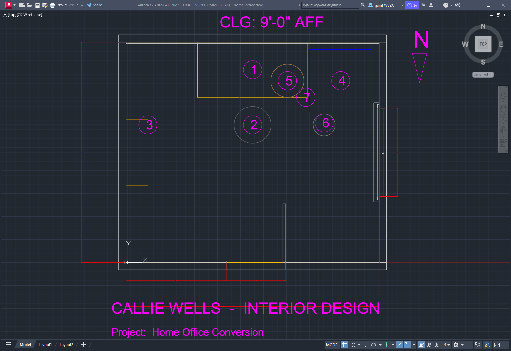
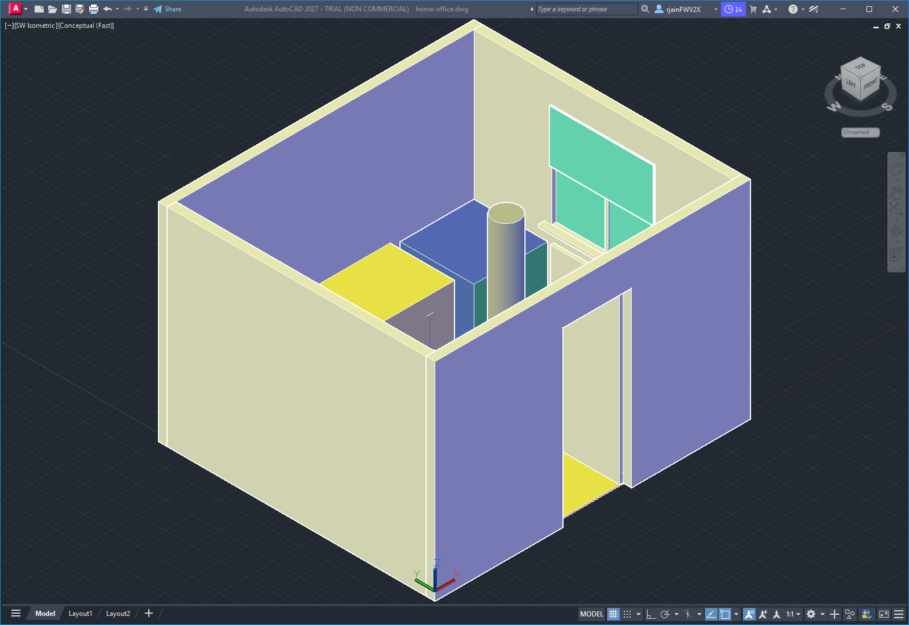

# Home Office Conversion
### Designed by Callie Wells · Interior Design

**Project:** Home Office Conversion (spare bedroom, 11'-6" × 10'-0")
**Location:** Rancho Santa Margarita, California
**Date:** 2026-04-25
**Sheet set:** A-101 Floor Plan & FF&E · 3D Presentation View

---

## Sheet 1 — Floor plan, dimensioned, with FF&E tags

The plan calls out:
- Overall room dimensions (11'-6" × 10'-0", 115 SF)
- Door opening (2'-8" wide on south wall)
- Window opening (4'-0" wide on east wall, centered vertically)
- Numbered FF&E tags 1 through 7 — see schedule on page 3
- North arrow (top-right)
- Title block (bottom-left)

Drawn at 1/2" = 1'-0" (plot scale 1:24).

---

## Sheet 2 — 3D presentation view

Southwest isometric view in AutoCAD's Conceptual visual style. The ceiling
layer (`A-CLNG`) is frozen so the viewer can see into the room. Materials
are shown as flat colors keyed to the finish schedule:

- Cream walls, white trim & baseboards
- Walnut floor (LVP), warm walnut tone
- Walnut desk and bookcase
- Charcoal task chair (cylinder)
- Blue-gray armchair, cream-top side table, dark-gray floor lamp
- Indigo area rug under the reading nook
- Glass + muntins + tan roller shade on the east window

---

## Sheet 3 — Schedules and specification

For the full FF&E schedule, finish schedule, lighting and power notes,
scope exclusions, and project narrative, see [`SPEC.md`](SPEC.md).

---

## Files in this deliverable

| File | What it is |
| --- | --- |
| `floor-plan.png` | Sheet A-101 — dimensioned plan with FF&E tags |
| `presentation-iso.png` | Sheet — 3D presentation view |
| `home-office.dwg` | Source AutoCAD file (54 entities) |
| `SPEC.md` | Full project specification and schedules |
| `PRESENTATION.md` | This client-facing cover sheet |

---

*Designed remotely. All dimensions field-verify before purchase orders are
issued. Vendor names are equivalents — final selections subject to client
approval and current lead times.*
