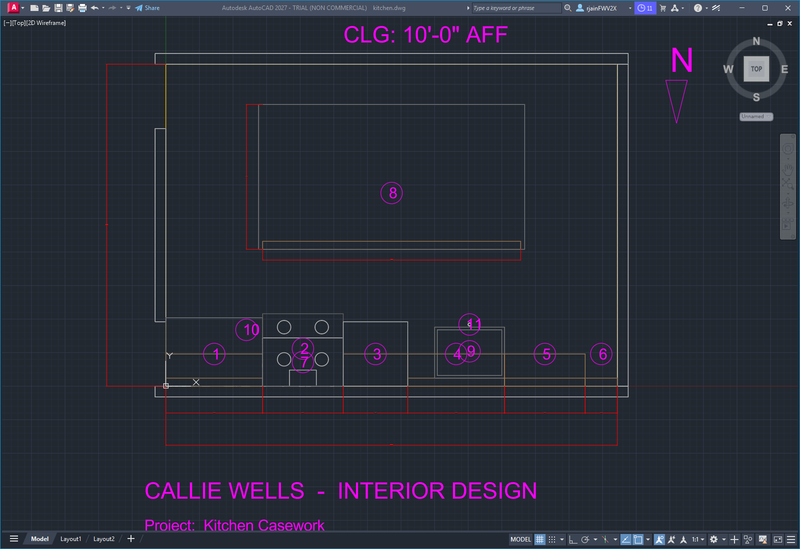
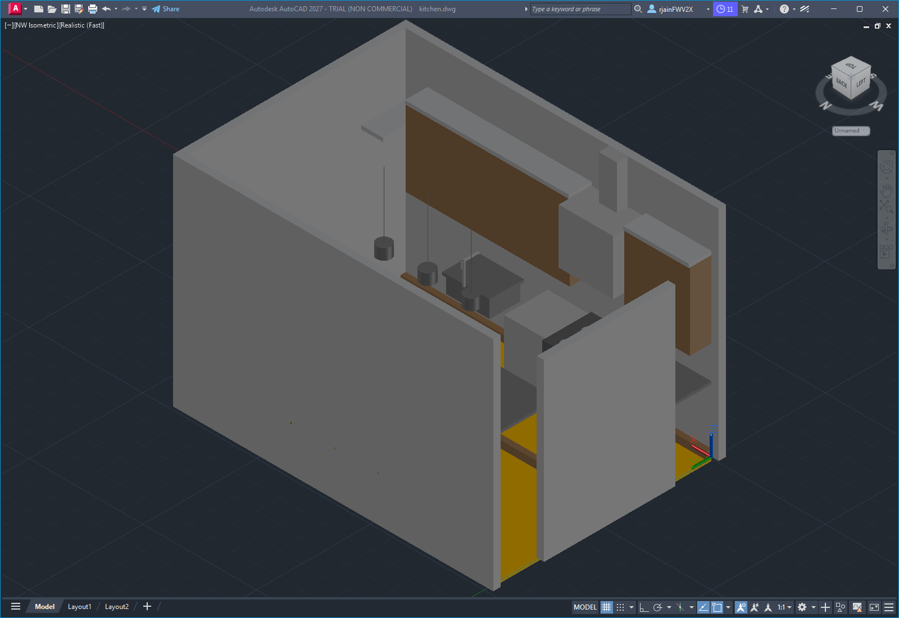
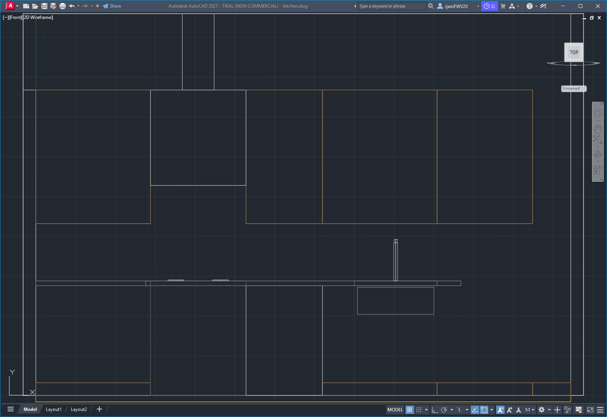
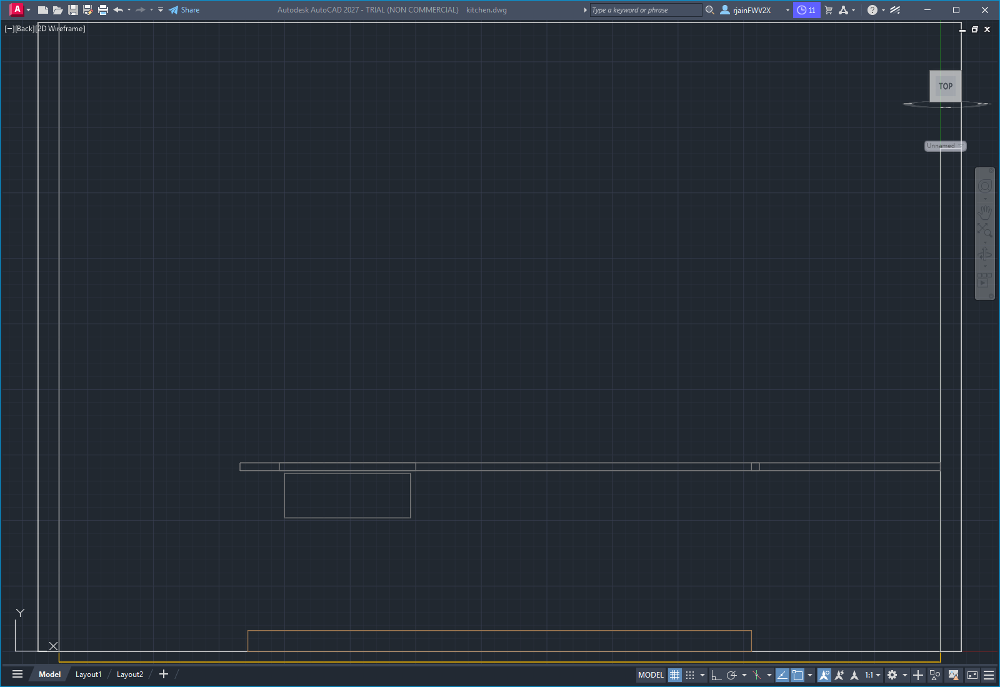

# Kitchen Casework
### Designed by Callie Wells · Interior Design

**Project:** Single-wall Kitchen with Island
**Location:** Rancho Santa Margarita, California
**Date:** 2026-04-27
**Sheet set:** A-201 Plan, Elevations & 3D

---

## Sheet 1 — Floor plan

The plan calls out:
- Overall room dimensions (14'-0" × 10'-0", 140 SF)
- Cabinet-run chain dimensions: B36 → R30 → DW24 → SB36 → B30 → P12
- Island: 96" × 42" with 12" overhang on the north (seating) side
- 6'-0" hallway opening to dining room on west wall
- Numbered tags 1–11 keyed to the FF&E + casework schedule in `SPEC.md`
- North arrow (top-right)
- Title block (bottom-left)

Drawn at 1/2" = 1'-0" (plot scale 1:24).

---

## Sheet 2 — 3D presentation view

Northeast isometric, AutoCAD Conceptual visual style. Ceiling is frozen
so the viewer can see into the room. The view shows:
- South-wall cabinet run with painted-Shaker base + wall cabinets
- 30" range with cooktop grates, range hood ducted up through the soffit
- Stainless dishwasher panel
- Sink base with the sink subtract cutout visible
- Tall east-end pantry full-height
- Island in the foreground with the seating overhang

A photoreal render with materials and lighting can be produced on
request.

---

## Sheet 3 — Long-wall elevation

Front view of the south-wall cabinet run. Shows the proportional
relationship between the wall cabinets at 54"–96" AFF and the base
cabinets at 0"–36" AFF, with the range hood centered above the cooktop
gap, the sink basin and faucet at the SB36 location, and the tall pantry
breaking the cabinet line on the east end.

Drawn at 1/2" = 1'-0".

---

## Sheet 4 — Island elevation

Back view of the island showing the cabinet body with toe kick on the
storage side and the counter line above. The 12" seating overhang is
visible at the top of the cabinet box.

---

## Sheet 5 — Schedules and specification

For the full FF&E + casework schedule, finish schedule, lighting,
power & data, plumbing notes, modeling-command crosswalk, scope
exclusions, and project narrative, see [`SPEC.md`](SPEC.md).

---

## Files in this deliverable

| File | What it is |
| --- | --- |
| `floor-plan.png` | Sheet A-201 — dimensioned plan with tags |
| `presentation-iso.png` | 3D presentation view (NE iso, Conceptual) |
| `elevation-long-wall.png` | Long-wall elevation (FRONT view, 2D wireframe) |
| `elevation-island.png` | Island elevation (BACK view, 2D wireframe) |
| `kitchen.dwg` | Source AutoCAD file (71 entities, 12 layers) |
| `SPEC.md` | Full project specification |
| `Kitchen-Spec.docx` | Formal Word deliverable |
| `PRESENTATION.md` | This client-facing cover sheet |

---

*Designed remotely. All dimensions field-verify before fabrication. Vendor
names where noted are equivalents — final selections subject to client
approval and current lead times.*
