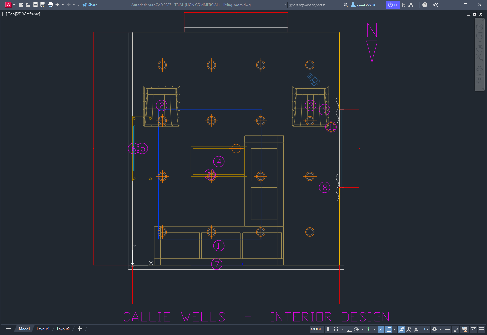
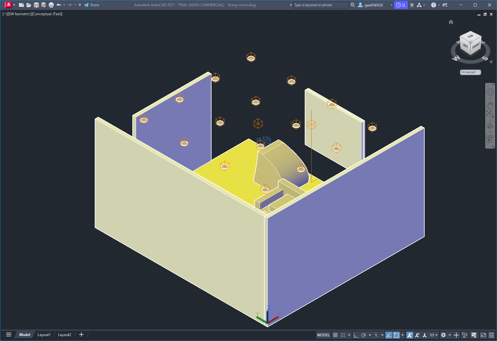

# Coastal Living Room
### Designed by Callie Wells · Interior Design

**Project:** Coastal-Contemporary Living Room (real-estate staging style)
**Location:** Rancho Santa Margarita, California
**Date:** 2026-04-27
**Sheet set:** A-501 Floor Plan & FF&E · 3D Presentation View

---

## Sheet 1 — Floor plan, dimensioned, with FF&E tags

The plan calls out:
- Overall room dimensions (16'-0" × 18'-0", 288 SF)
- 8'-0" hallway opening on the north wall
- 4'-0" window opening on the east wall, sill at 30" AFF
- Numbered FF&E tags 1 through 11 — see schedule in `SPEC.md`
- 16 recessed-can locations in the coffered ceiling (orange crosshair markers)
- North arrow (top-right)
- Title block (bottom-left)

Drawn at 1/4" = 1'-0" (plot scale 1:48).

---

## Sheet 2 — 3D presentation view

Southwest isometric view in AutoCAD's Conceptual visual style. Ceiling is
frozen so the viewer can see into the room. Materials are shown as flat
fills keyed to the finish schedule — the white-oak floor, oatmeal sectional,
indigo rug, walnut accents, sheer drape on the east window, and brass
floor lamp all read as their intended palette.

A photoreal render pass with sun-based lighting is available on request;
this Conceptual snapshot is the working presentation image.

---

## Sheet 3 — Schedules and specification

For the full FF&E schedule, finish schedule, lighting plan, switching
control, modeling-command crosswalk, scope exclusions, and project
narrative, see [`SPEC.md`](SPEC.md).

---

## Files in this deliverable

| File | What it is |
| --- | --- |
| `floor-plan.png` | Sheet A-501 — dimensioned plan with FF&E tags |
| `presentation-iso.png` | 3D presentation view (SW iso, Conceptual) |
| `hero.png`, `editorial.png` | Saved camera views (Conceptual snapshot) |
| `living-room.dwg` | Source AutoCAD file (109 entities, 13 layers, 12 materials, 17 lights, 2 named views) |
| `SPEC.md` | Full project specification and schedules |
| `Living-Room-Spec.docx` | Formal Word deliverable |
| `PRESENTATION.md` | This client-facing cover sheet |

---

*Designed remotely. All dimensions field-verify before purchase orders are
issued. Vendor names are equivalents — final selections subject to client
approval and current lead times.*
